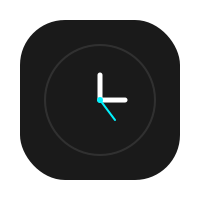
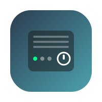
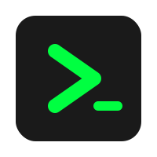
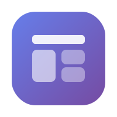

# NetherOS

## 🌐 What is NetherOS?

* It is not a standalone OS but custom OS-like environment for Windows 10/11 that runs on top of the system.
* Certain apps for windows that can replace default pre-installed windows apps.
* Programmed in C#.
* Runs on .NET 8 or .NET 10.

## 📦 Apps

| Icon | App | Development Status |
|------|-----|-------------------|
|  | Calculator | Does not work |
|  | Clocks | Works but improvements are planned |
|  | Explorer | Works but improvements are planned |
|  | Music | Works but improvements are planned |
|  | Photos | Does not work |
|  | Videos | Works but improvements are planned |
|  | Server | Works but improvements are planned |
|  | System Monitor | Planned |
|  | Terminal | Works but improvements are planned |
|  | UI | Works but improvements are planned |

## 📋 Requirements

* Windows 10/11
* some apps may be able to run on windows 7 but it is not garantueed

## ⚙️ How It Works

NetherOS runs as a layer on top of Windows:

* Uses native Windows processes
* Overrides or replaces parts of the user interface (if applicable)
* Manages apps inside its own environment
